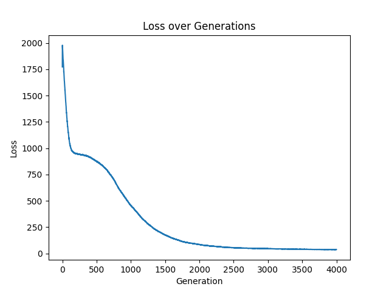
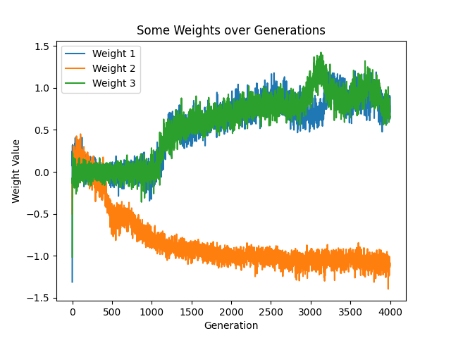
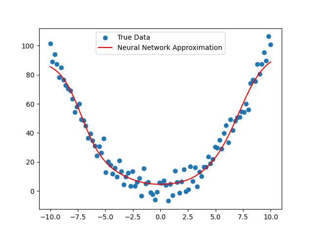
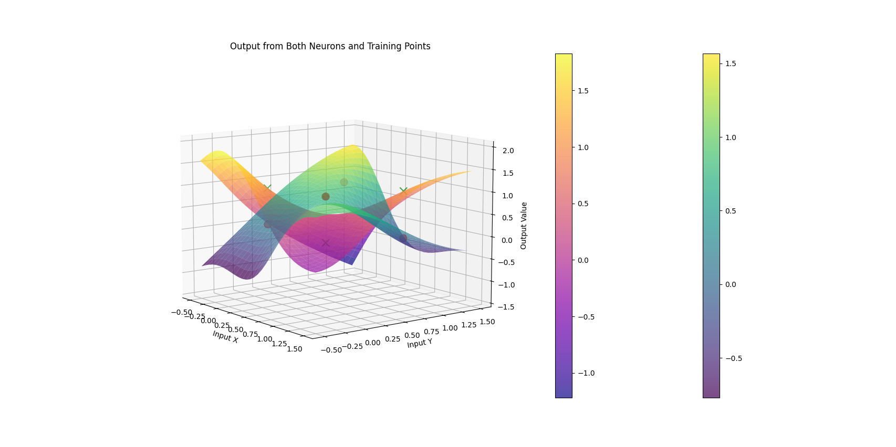

# Machine Learning Examples

## Overview

Welcome to the "Machine Learning Examples" repository. This repository is a collection of custom-built machine learning models demonstrating various approaches to regression and classification problems. Each model is uniquely designed using different neural network architectures and evolutionary strategies, all written from scratch.

Below, we present a selection of results achieved through the application of the Artificial Neural Network (ANN) model, coupled with Evolutionary Strategies (ES) for optimization. These outcomes pertain to both regression and classification tasks.

  
  
  
  

## Contents

- [ReggresionRBFAndES.py](#reggresionrbfandespy)
- [RegresionANNAndES.py](#regresionannandespy)
- [ClassificationANNAndES.py](#classificationannandespy)
- [RegresionPolynomialAndES.py](#regresionpolynomialandespy)

### ReggresionRBFAndES.py

Implements regression using Radial Basis Function (RBF) networks combined with Evolutionary Strategies (ES). Ideal for complex, non-linear data modeling.

### RegresionANNAndES.py

Demonstrates regression with Artificial Neural Networks (ANN) and Evolutionary Strategies. It exemplifies ANN's use in continuous value prediction and optimization.

### ClassificationANNAndES.py

Focuses on binary classification using ANNs and ES. It solves a simple XOR classification problem, showcasing neural network utility in classification tasks.

### RegresionPolynomialAndES.py

Presents regression using polynomial models and ES. It highlights polynomial regression's effectiveness for data with a polynomial distribution.
